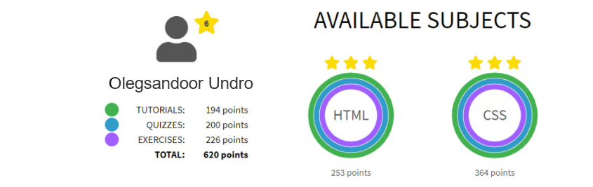

## Olegsandoor Undro
---
#### Baby-Junior Frontend Developer
---
#### Contact information:
__Phone:__ +375 29 123 45 67
__E-mail:__ xrystik.top@gmail.com
__Telegram:__ @olegsandoor

---
#### Briefly about Myself:
Hello everyone, my name is Oleja and I want to tell you a little about myself. My goal is to nafti your goal. My priorities for life are to learn something useful and go to work for some IT company.

My work experience is quite small, because I almost did not study at the university for a year, but my desire to study and learn new things exceeds all boundaries. In life, I am very hardworking and ready to face many difficulties in order to overcome them and achieve my goal.

 I also want to make reliable friends to work together on projects and improve my programming skills.

---
#### Skills and Proficiency:
- HTML5, CSS3
- Git, GitHub
- VS Code, Visual Studio
- Adobe Photoshop, Inkscape, Blender, Notepad
---
#### Code example:
__Cout << "Hello World":__ _At first glance, it may seem that this is a primitive task for the output of a sentence, but everything is not so simple. The #include iostream directive connects a standard library header file for working with input-output streams. For printing, we use the output stream std::cout, where cout stands for character output, that is, "character output". However, the phrase using namespace std; means nothing more than importing the entire namespace std. This namespace contains all the names from the C++ standard library, such as the cin output stream or the string class. And in conclusion, Return 0 means that the function returns an integer to the calling function._

        #include <iostream>
        using namespace std;
        int main()
        {
            cout << "Hello World";
            return 0;
        }
---
### Courses:
- HTML and CSS Tutorials on the [w3schools](https://www.w3schools.com/quiztest/result.asp) (completed)

- JavaScript Manual on [learn.javascript.ru](https://learn.javascript.ru/) (in progress)
- RS Schools Course «JavaScript/Front-end. Stage 0» (in progress)
---
### Languages:
- English - intermediate/Upper-intermediate (according to the online test at  [www.efset.org](https://www.efset.org/quick-check/take-test/#set15-190/result))

